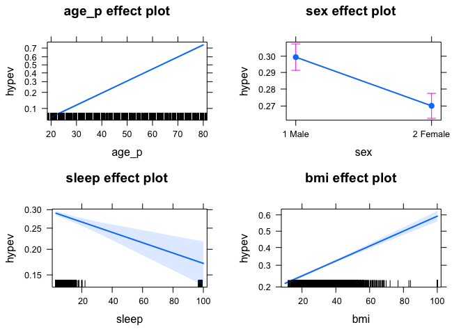
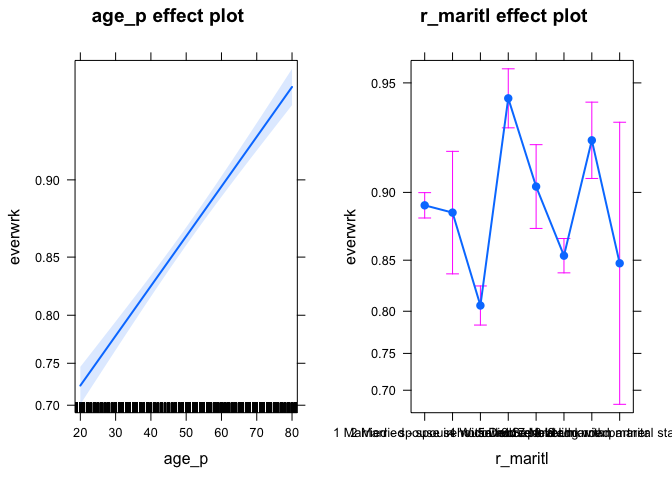

Logistic Regression
================

### Regression with binary outcomes

### Logistic regression

his far we have used the `lm' function to fit our regression models.`lm' is great, but limited–in particular it only fits models for continuous dependent variables. For categorical dependent variables we can use the \`glm()' function.

For these models we will use a different dataset, drawn from the National Health Interview Survey. From the \[CDC website\]:

The National Health Interview Survey (NHIS) has monitored the health of the nation since 1957. NHIS data on a broad range of health topics are collected through personal household interviews. For over 50 years, the U.S. Census Bureau has been the data collection agent for the National Health Interview Survey. Survey results have been instrumental in providing data to track health status,ealth care access, and progress toward achieving national health objectives.

``` r
##   Load the National Health Interview Survey data:
NH11 <- readRDS("dataSets/NatHealth2011.rds")
labs <- attributes(NH11)$labels
```

\[CDC website\] (<http://www.cdc.gov/nchs/nhis.htm>)

### Logistic regression example

Let's predict the probability of being diagnosed with hypertension based on age, sex, sleep, and bmi

``` r
str(NH11$hypev) # check stucture of hypev
```

    ##  Factor w/ 5 levels "1 Yes","2 No",..: 2 2 1 2 2 1 2 2 1 2 ...

``` r
levels(NH11$hypev) # check levels of hypev
```

    ## [1] "1 Yes"             "2 No"              "7 Refused"        
    ## [4] "8 Not ascertained" "9 Don't know"

``` r
# collapse all missing values to NA

NH11$hypev <- factor(NH11$hypev, levels=c("2 No", "1 Yes"))

# run our regression model
hyp.out <- glm(hypev~age_p+sex+sleep+bmi,
              data=NH11, family="binomial")

coef(summary(hyp.out))
```

    ##                 Estimate   Std. Error    z value     Pr(>|z|)
    ## (Intercept) -4.269466028 0.0564947294 -75.572820 0.000000e+00
    ## age_p        0.060699303 0.0008227207  73.778743 0.000000e+00
    ## sex2 Female -0.144025092 0.0267976605  -5.374540 7.677854e-08
    ## sleep       -0.007035776 0.0016397197  -4.290841 1.779981e-05
    ## bmi          0.018571704 0.0009510828  19.526906 6.485172e-85

### Logistic regression coefficients

Generalized linear models use link functions, so raw coefficients are difficult to interpret. For example, the age coefficient of .06 in the previous model tells us that for every one unit increase in age, the log odds of hypertension diagnosis increases by 0.06. Since most of us are not used to thinking in log odds this is not too helpful! One solution is to transform the coefficients to make them easier to interpret

``` r
hyp.out.tab <- coef(summary(hyp.out))
hyp.out.tab[, "Estimate"] <- exp(coef(hyp.out))
hyp.out.tab
```

    ##               Estimate   Std. Error    z value     Pr(>|z|)
    ## (Intercept) 0.01398925 0.0564947294 -75.572820 0.000000e+00
    ## age_p       1.06257935 0.0008227207  73.778743 0.000000e+00
    ## sex2 Female 0.86586602 0.0267976605  -5.374540 7.677854e-08
    ## sleep       0.99298892 0.0016397197  -4.290841 1.779981e-05
    ## bmi         1.01874523 0.0009510828  19.526906 6.485172e-85

Generating predicted values
---------------------------

In addition to transforming the log-odds produced by `glm' to odds, we can use the`predict()' function to make direct statements about the predictors in our model. For example, we can ask "How much more likely is a 63 year old female to have hypertension compared to a 33 year old female?".

``` r
# Create a dataset with predictors set at desired levels
predDat <- with(NH11,
                expand.grid(age_p = c(33, 63),
                            sex = "2 Female",
                            bmi = mean(bmi, na.rm = TRUE),
                            sleep = mean(sleep, na.rm = TRUE)))
# predict hypertension at those levels
cbind(predDat, predict(hyp.out, type = "response",
                       se.fit = TRUE, interval="confidence",
                       newdata = predDat))
```

    ##   age_p      sex      bmi   sleep       fit      se.fit residual.scale
    ## 1    33 2 Female 29.89565 7.86221 0.1289227 0.002849622              1
    ## 2    63 2 Female 29.89565 7.86221 0.4776303 0.004816059              1

This tells us that a 33 year old female has a 13% probability of having been diagnosed with hypertension, while and 63 year old female has a 48% probability of having been diagnosed.

### Packages for computing and graphing predicted values

Instead of doing all this ourselves, we can use the effects package to compute quantities of interest for us (cf. the Zelig package).

``` r
library(effects)
```

    ## Warning: package 'effects' was built under R version 3.4.1

    ## Loading required package: carData

    ## Warning: package 'carData' was built under R version 3.4.1

    ## lattice theme set by effectsTheme()
    ## See ?effectsTheme for details.

``` r
plot(allEffects(hyp.out))
```



### Exercise: logistic regression

### Use the NH11 data set that we loaded earlier.

1.  Use glm to conduct a logistic regression to predict ever worked (everwrk) using age (age\_p) and marital status (r\_maritl).

2.  Predict the probability of working for each level of marital status.

Note that the data is not perfectly clean and ready to be modeled. You will need to clean up at least some of the variables before fitting the model.

``` r
## Check the structure of everwrk
str(NH11$everwrk)
```

    ##  Factor w/ 5 levels "1 Yes","2 No",..: NA NA 1 NA NA NA NA NA 1 1 ...

``` r
## Check the summary of everwrk
summary(NH11$everwrk)
```

    ##             1 Yes              2 No         7 Refused 8 Not ascertained 
    ##             12153              1887                17                 0 
    ##      9 Don't know              NA's 
    ##                 8             18949

``` r
## check levels of everwrk
levels(NH11$everwrk)
```

    ## [1] "1 Yes"             "2 No"              "7 Refused"        
    ## [4] "8 Not ascertained" "9 Don't know"

``` r
## check stucture of age_p
str(NH11$age_p)
```

    ##  num [1:33014] 47 18 79 51 43 41 21 20 33 56 ...

``` r
## Check the summary of age_p
summary(NH11$age_p)
```

    ##    Min. 1st Qu.  Median    Mean 3rd Qu.    Max. 
    ##   18.00   33.00   47.00   48.11   62.00   85.00

``` r
## check levels of age_p
levels(NH11$age_p)
```

    ## NULL

``` r
## check stucture of r_maritl
str(NH11$r_maritl)
```

    ##  Factor w/ 10 levels "0 Under 14 years",..: 6 8 5 7 2 2 8 8 8 2 ...

``` r
## Check the summary of r_maritl
summary(NH11$r_maritl)
```

    ##                        0 Under 14 years 
    ##                                       0 
    ##         1 Married - spouse in household 
    ##                                   13943 
    ##     2 Married - spouse not in household 
    ##                                     531 
    ## 3 Married - spouse in household unknown 
    ##                                       0 
    ##                               4 Widowed 
    ##                                    3069 
    ##                              5 Divorced 
    ##                                    4511 
    ##                             6 Separated 
    ##                                    1121 
    ##                         7 Never married 
    ##                                    7763 
    ##                   8 Living with partner 
    ##                                    2002 
    ##                9 Unknown marital status 
    ##                                      74

``` r
## check levels of r_maritl
levels(NH11$r_maritl)
```

    ##  [1] "0 Under 14 years"                       
    ##  [2] "1 Married - spouse in household"        
    ##  [3] "2 Married - spouse not in household"    
    ##  [4] "3 Married - spouse in household unknown"
    ##  [5] "4 Widowed"                              
    ##  [6] "5 Divorced"                             
    ##  [7] "6 Separated"                            
    ##  [8] "7 Never married"                        
    ##  [9] "8 Living with partner"                  
    ## [10] "9 Unknown marital status"

### choose the values Yes and No for everwrk

``` r
NH11$everwrk <- factor(NH11$everwrk, levels=c("2 No", "1 Yes"))
```

### Run a logistic regression model with everwrk

``` r
Log_model  <- glm(everwrk~age_p+r_maritl, data=NH11, family="binomial")
summary(Log_model)
```

    ## 
    ## Call:
    ## glm(formula = everwrk ~ age_p + r_maritl, family = "binomial", 
    ##     data = NH11)
    ## 
    ## Deviance Residuals: 
    ##     Min       1Q   Median       3Q      Max  
    ## -2.7308   0.3370   0.4391   0.5650   1.0436  
    ## 
    ## Coefficients:
    ##                                              Estimate Std. Error z value
    ## (Intercept)                                  0.440248   0.093538   4.707
    ## age_p                                        0.029812   0.001645  18.118
    ## r_maritl2 Married - spouse not in household -0.049675   0.217310  -0.229
    ## r_maritl4 Widowed                           -0.683618   0.084335  -8.106
    ## r_maritl5 Divorced                           0.730115   0.111681   6.538
    ## r_maritl6 Separated                          0.128091   0.151366   0.846
    ## r_maritl7 Never married                     -0.343611   0.069222  -4.964
    ## r_maritl8 Living with partner                0.443583   0.137770   3.220
    ## r_maritl9 Unknown marital status            -0.395480   0.492967  -0.802
    ##                                             Pr(>|z|)    
    ## (Intercept)                                 2.52e-06 ***
    ## age_p                                        < 2e-16 ***
    ## r_maritl2 Married - spouse not in household  0.81919    
    ## r_maritl4 Widowed                           5.23e-16 ***
    ## r_maritl5 Divorced                          6.25e-11 ***
    ## r_maritl6 Separated                          0.39742    
    ## r_maritl7 Never married                     6.91e-07 ***
    ## r_maritl8 Living with partner                0.00128 ** 
    ## r_maritl9 Unknown marital status             0.42241    
    ## ---
    ## Signif. codes:  0 '***' 0.001 '**' 0.01 '*' 0.05 '.' 0.1 ' ' 1
    ## 
    ## (Dispersion parameter for binomial family taken to be 1)
    ## 
    ##     Null deviance: 11082  on 14039  degrees of freedom
    ## Residual deviance: 10309  on 14031  degrees of freedom
    ##   (18974 observations deleted due to missingness)
    ## AIC: 10327
    ## 
    ## Number of Fisher Scoring iterations: 5

``` r
coef(summary(Log_model))
```

    ##                                                Estimate  Std. Error
    ## (Intercept)                                  0.44024757 0.093537691
    ## age_p                                        0.02981220 0.001645433
    ## r_maritl2 Married - spouse not in household -0.04967549 0.217309587
    ## r_maritl4 Widowed                           -0.68361771 0.084335382
    ## r_maritl5 Divorced                           0.73011485 0.111680788
    ## r_maritl6 Separated                          0.12809081 0.151366140
    ## r_maritl7 Never married                     -0.34361068 0.069222260
    ## r_maritl8 Living with partner                0.44358296 0.137769623
    ## r_maritl9 Unknown marital status            -0.39547953 0.492966577
    ##                                                z value     Pr(>|z|)
    ## (Intercept)                                  4.7066328 2.518419e-06
    ## age_p                                       18.1181481 2.291800e-73
    ## r_maritl2 Married - spouse not in household -0.2285932 8.191851e-01
    ## r_maritl4 Widowed                           -8.1059419 5.233844e-16
    ## r_maritl5 Divorced                           6.5375152 6.254929e-11
    ## r_maritl6 Separated                          0.8462316 3.974236e-01
    ## r_maritl7 Never married                     -4.9638756 6.910023e-07
    ## r_maritl8 Living with partner                3.2197443 1.283050e-03
    ## r_maritl9 Unknown marital status            -0.8022441 4.224118e-01

### Plot the results of regression

``` r
plot(allEffects(Log_model))
```


